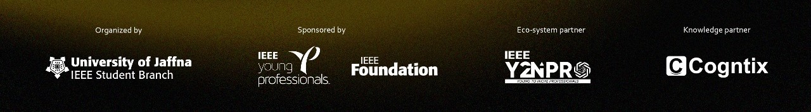
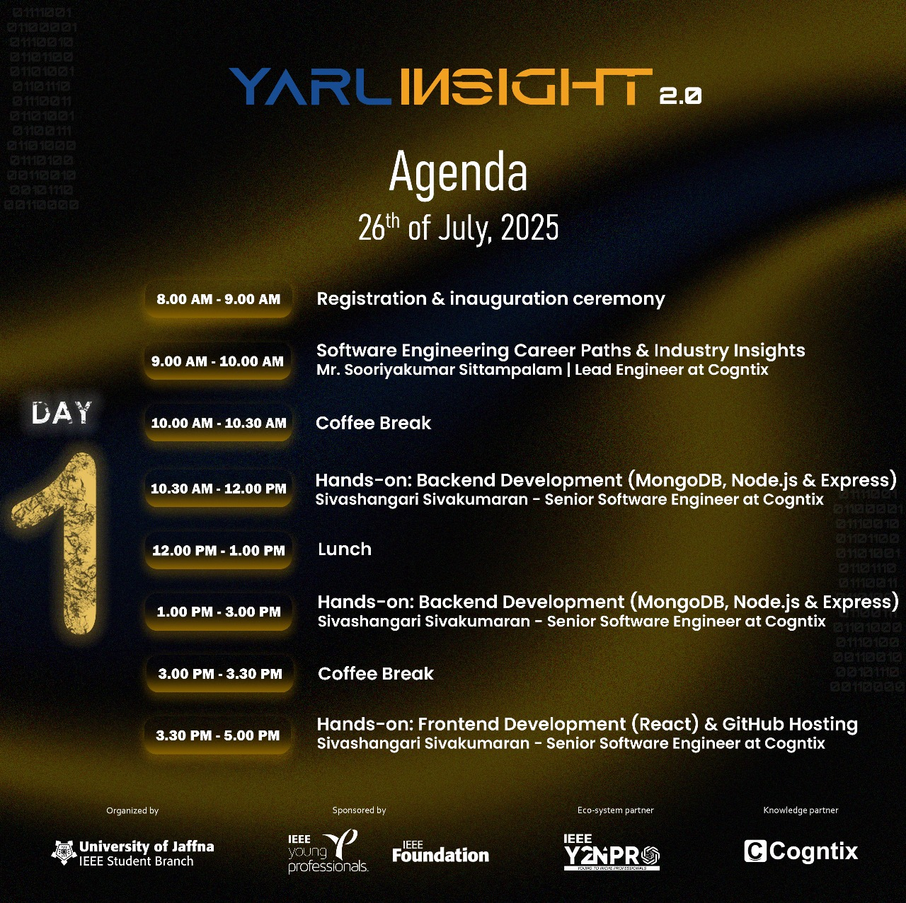
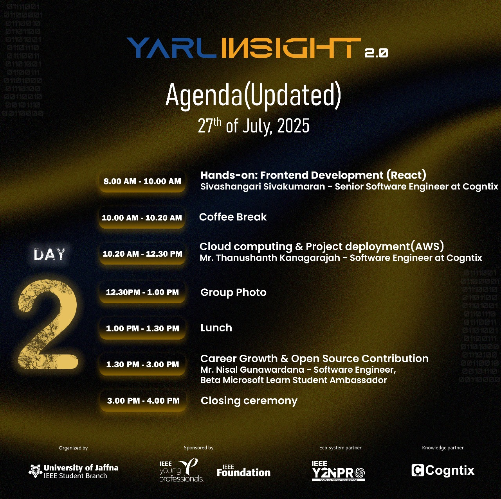

# 📝 MERN ToDo Application

A full-stack **To Do app** built with the MERN stack and deployed on AWS EC2—developed as part of the "YarlInsight 2.0" summer school at the University of Jaffna. This project is a hands-on exploration of modern web development, cloud infrastructure, and DevOps best practices.

---

## 🚀 Features

- **Create, Read, Update & Delete Tasks**: Easily manage your daily tasks in one place.
- **User-Friendly Interface**: Intuitive React frontend for seamless task management.
- **Secure API**: Node.js & Express backend with robust REST API endpoints.
- **Persistent Data**: All data stored on MongoDB, ensuring your tasks are safe and accessible.
- **Cloud Deployment**: Hosted on an AWS EC2 instance for global availability and reliability.
- **Open Source Foundation**: Embracing collaborative best practices using Git and GitHub.

---

## 💻 Tech Stack

- **Frontend**: React, JavaScript
- **Backend**: Node.js, Express.js
- **Database**: MongoDB
- **Cloud**: AWS EC2 for deployment

---

## 🌟 Learning Highlights from YarlInsight 2.0

- Designed and developed the complete MERN stack application in a collaborative setting.
- Mastered RESTful API concepts, state management in React, middleware integration in Express, and secure MongoDB operations.
- Hands-on experience deploying scalable web applications on AWS EC2 instances.
- Networked with industry professionals and peers, gaining best practices in cloud computing, GitHub project management, and open source contributions.

---

## 🎓 Special Thanks

Grateful to:
- **YarlInsight 2.0** organizers and mentors
- **IEEE Student Branch, University of Jaffna**
- [Nisal Gunawardhana](https://www.linkedin.com/in/ACoAADjD0ugBGBVfHbAWOsRfedX0J_MFZ0QJp0U) (Microsoft Student Ambassador & session host)
- Workshop speakers and peer learners

For providing a platform to learn, innovate, and grow together! 🙏

---

## 📸 Event Gallery

<!-- Banner Image -->

<!-- Organized Team Image (e.g., IEEE Student Branch UOJ) -->

<!-- Day-wise Agendas -->

---

> *Built as part of a transformative learning experience at YarlInsight 2.0 — empowering the next wave of tech creators!*
